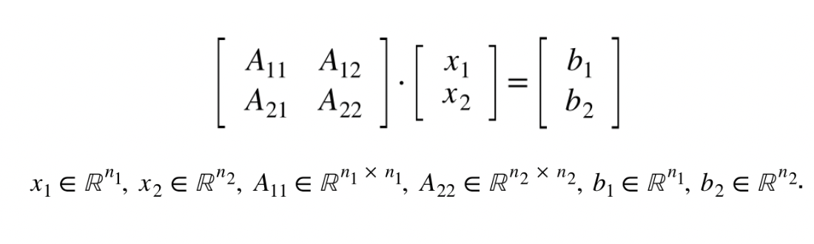
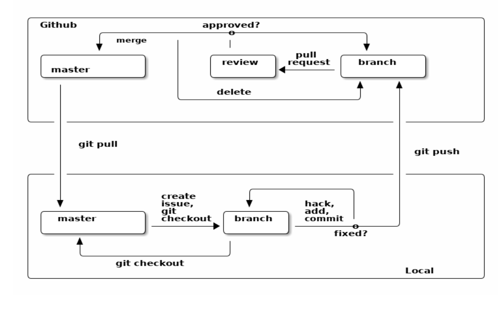

Método de eliminación por bloques  y descomposición SVD para sistemas lineales
==============================

El propósito de este proyecto es consolidar una **implementación del método de eliminación por bloques para la solución de sistemas lineales, empleando el lenguaje de programación R**. Para ello, también se aborda la **implementación del algoritmo One-Sided Jacobi** para aproximar numéricamente la descomposición en valores singulares de una matriz (SVD, por sus siglas en ingles) el cual se emplea como una herramienta que permite resolver numéricamente sistemas lineales más pequeños que surjen al considerar bloques de una matriz.

## Tabla de contenido

1. [Introduction](https://github.com/mno-2020-gh-classroom/ex-modulo-3-comp-matricial-svd-czammar/blob/master/README.md#introducción)
2. [Overview](https://github.com/mno-2020-gh-classroom/ex-modulo-3-comp-matricial-svd-czammar/blob/master/README.md#overview)

## Introducción 

Al tratar de encontrar la solución de sistemas lineales de tamaño considerable, una estrategia interesante es recurrir a métodos que intercambien el problema original por hallar la respuesta de una serie de sistemas de ecuaciones de menor dimensión, que puedan ser resueltos con otras técnicas y cuyas soluciones permitan armar la solución del sistema que originalmente era de ínterés. 

Por otro lado, la descomposición SVD de una matriz $A$ consiste hallar una factorización de ésta en términos de dos matrices ortonormales U y V asociadas a su dominio y co-dominio, junto con una matriz diagonal $\Sigma$ cuyas entradas se encuentra determinadas por los **valores singulares** de $A$. En el contexto de un problema de resolver un sistema $Ax=b$, dicha estructura se puede aprovechar para usar la estructura de las matrices $U$, $V$ y $\Sigma$, para replantear el sistema original, en otro más sencillo que se puede resolver con sustitución atrás/adelante, para posteriorme recuperar la solución de interés con una multiplicación *matriz-vector*.

Así pues, para implementar la solución de sistemas lineales la implementación a través del método de eliminación por bloques, se puede  método que echar mano de la factorización SVD para dar solución a los sistemas lineales de menor dimensión que resultar de re-expresar el problema en términos de sus correspondientes bloques.

Estas ideas fueron exploraras en el presente proyecto, para la implementación llevada a cabo del método de eliminación por bloques.

## Overview

**Método de eliminación por bloques**

El método de eliminación por bloques consiste en obtener solución a un sistema lineal $Ax=b$ pensando en que $A$, $b$ y $x$ se puede dividir en términos bloques, $A_{11}$,$A_{12}$,$A_{21}$ y $A_{22}$, $b_1$ y $b_2$ junto con $x_1$ y $x_2$, tal como se aprecia en la siguiente imagen:



En el caso de que $A_{11}$ sea invertible (no singular), las ecuaciones inducidas por los bloques se pueden resolver como sigue:

1. Si conocemos $x_2$, entonces de la primera ecuación de bloquespodemos obtener $x_1$ al resolver el sistema $A_{11} x_1 = b_1-A_{12}x_2$ o de modo equivalente $x_1 = A_{11}^{-1}(b_1-A_{12}x_2)$, que es un sistema lineal de menores dimensiones.
2. Por otro lado, haciendo los cálculos, de la segunda ecuación por bloques se sigue que $S x_2 = b_2 - A_{21}A_{11}^{-1}b_1$, en donde a) $S := A_{22}-A_{21}A_{11}^{-1}A_{12}$ se conoce como el **complemento de Schur** del bloque $A_{11}$ en $A$, y b) $S$ es no singular si y sólo si $A$ es no singular. Así para estimar $x_2$, basta resolver $S x_2 = b_2 - A_{21}A_{11}^{-1}b_1$ que es un sistema más pequeño.
3. La solución del sistema $Ax=b$ se obtiene en términos de $x_1$ y $x_2$.

Con este procedimiento reducimos el problema de hallar la solución de un sistema $Ax = b$, pero debemos contar con un método que permita resolve los sistemas lineales más pequeños que se describen en los numerales 1. y 2.

**Algoritmo de One-Sided Jacobi para descomposición SVD**

La factorización SVD de una matriz $A\in \mathbb{R}^m \times \mathbb{R}^n$, consiste en encontrar matrices $U \in \mathbb{R}^m \times \mathbb{R}^n$, $\Sigma \in \mathbb{R}^n \times \mathbb{R}^n$ y  $V \in \mathbb{R}^m \times \mathbb{R}^n$

Esta se puede aproximar con un método iterativo conocido como el **algoritmo One-Sided Jacobi** que se basa en la aplicación sucesiva de rotaciones de Givens, para ortogonalizar las columnas de las matrices involucradas, así como estimar los respectivos valores singulares.


Por tales motivos, este proyecto también aborda la implementación del **algoritmo One-Sided Jacobi** para aproximar numéricamente la descomposición en valores singulares de una matriz (SVD, por sus siglas en ingles), aprovechando sus propiedades para resolver un sistema lineal específico, junto con su aplicación inmediata para llevar a cabo el método de eliminación por bloques.

En este sentido, el proyecto gira en torno al desarrollo de siguientes ejes:

1. 
2. **Algoritmo One-sided Jacobi y descomposición SVD:** 
3. **Solver de sistemas lineales a partir**
4. **Método de eliminación por bloques para resolver sistemas lineales:** [pendiente: desarrollo].

## Flujo de trabajo en Github

grupo de programación, grupo de revisión y una persona project manager


Este proyecto ha sido desarrollado de forma colaborativa, en donde cada unos de los equipos se ha encargo de implementar módulos de código que permiten [pendiente: desarrollo]

Para re




**Fuente:** Notas del curso *Programación para Ciencia de Datos* de la Maestría en Ciencia de Datos del ITAM (2019). Véase https://github.com/ITAM-DS/programming-for-data-science-2019/blob/master/handbook.pdf

## Requerimientos de infraestructura
A efecto de que el equipo de programación y revisión tuviera un entorno común de trabajo para el desarrollo del proyecto, se empleó la imagen de docker basada en R del curso MNO 2020 (palmoreck/jupyterlab_r_kernel:1.1.0)

```bash
docker run --rm -v ($pwd):/datos --name jupyterlab_r_kernel_local -p 8888:8888 -d palmoreck/jupyterlab_r_kernel:1.1.0
```

Con ello se habilitó la posibilidad de realizar el trabajo mediante *Jupyter Notebooks*.

## Project Organization

```bash
├── README.md            <- Some text
├── References           <- Carpeta de materiales usados para desarrollo del proyecto
│   ├── 3.3.d.SVD.ipynb  <- Makefile with commands like `make data` or `make train`
│   ├── Images
│   ├── Minutas
│   ├── Readme.md
│   └── Simplified_SVD_OneSidedJacobi_Algorithm.md
├── jupyter
│   └── Ex_CM_SVD.ipynb
├── results               <- Carpeta de resultados
├── test                  <- Reportes derivados de issues del Equipo de Revisión
│   ├── Rev_FuncionSigno.ipynb
│   ├── Rev_GeneracionIndices.ipynb
│   ├── Rev_Generacion_de_Indices.ipynb
│   ├── Rev_One-sided_Jacobi.ipynb
│   ├── Rev_Solver_SVD.ipynb
│   ├── Rev_VerifOrtogonalidad.ipynb
│   └── Rev_parte2_One-sided_Jacobi.ipynb
```

